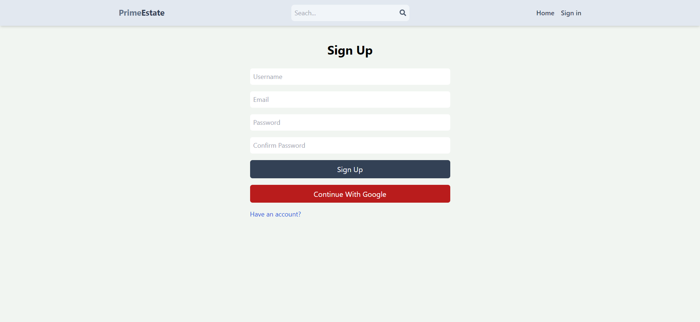
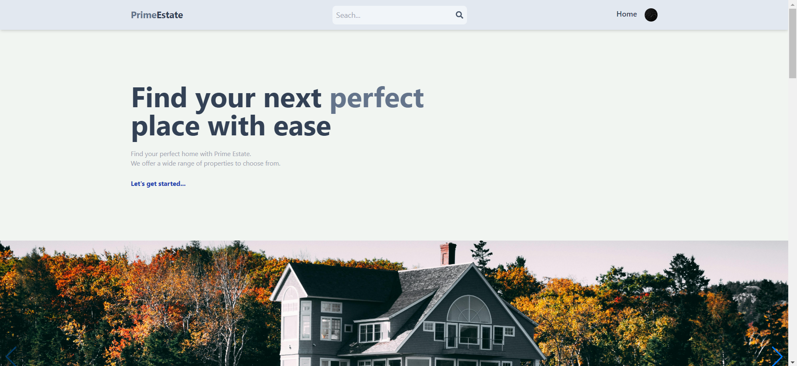
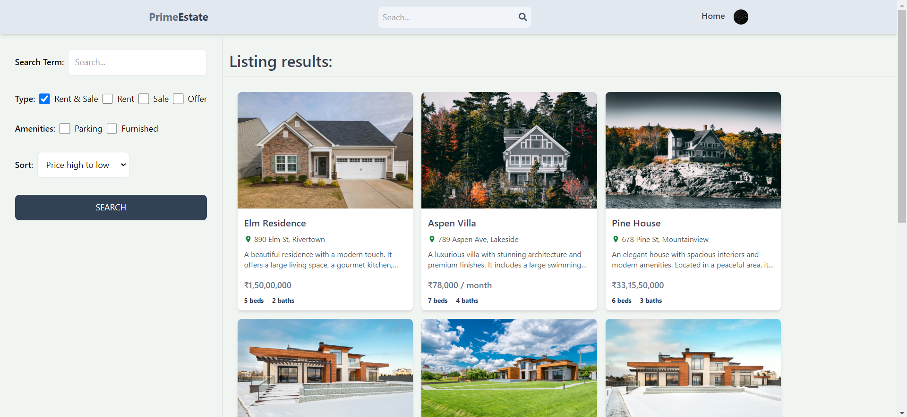
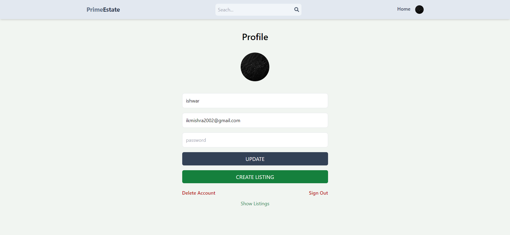
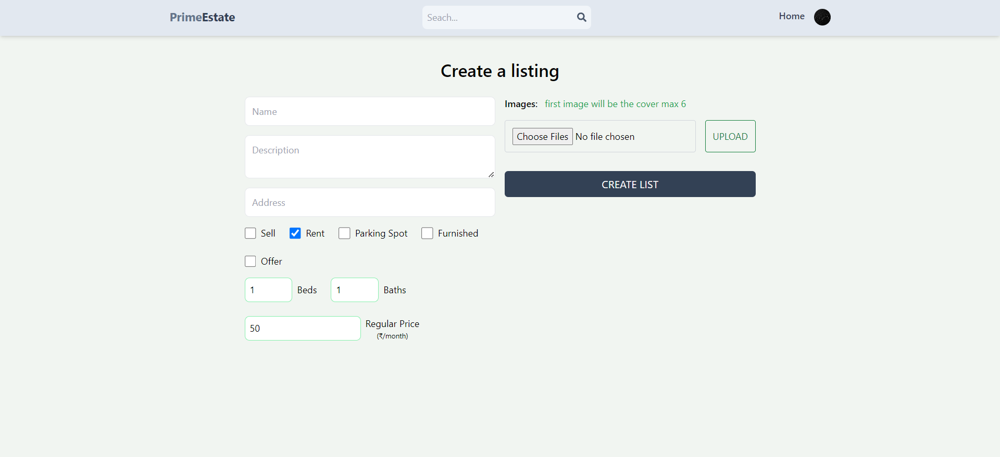

# Real Estate Application

## Project Overview

This project is a full-stack web application for a real estate platform called **Prime Estate**. It allows users to browse, create, update, and manage property listings. Users can also contact landlords for more information about the properties. The application is built using the MERN stack (MongoDB, Express, React, Node.js) and integrates with Firebase and JWT for authentication.

## Project Structure

### Backend

- **controllers**
  - **auth.controller.js**: Handles user authentication (sign-up, login).
  - **listing.controller.js**: Manages CRUD operations for property listings.
  - **user.controller.js**: Manages user-related operations (e.g., retrieving user information).

- **db**
  - Contains database connection configurations.

- **middleware**
  - Middleware functions (e.g., authentication checks).

- **model**
  - **listing.model.js**: Mongoose schema and model for property listings.
  - **user.model.js**: Mongoose schema and model for user information.

- **routes**
  - Defines API routes and maps them to corresponding controller functions.

- **utils**
  - Utility functions used throughout the backend.

- **server.js**
  - Entry point for the backend server.

### Frontend

- **src**
  - **components**
    - **skeletons**
      - **CardSkeleton.jsx**: Skeleton loader for cards.
      - **LoadingSpinner.jsx**: Spinner for loading states.
    - **Contact.jsx**: Component for contacting landlords.
    - **ListingItem.jsx**: Component to display a single listing item.
    - **Navbar.jsx**: Navigation bar component.
    - **OAuth.jsx**: OAuth integration component.

  - **pages**
    - **CreateListing.jsx**: Page for creating a new listing.
    - **Home.jsx**: Homepage of the application.
    - **Listing.jsx**: Detailed page for a single listing.
    - **Profile.jsx**: User profile page.
    - **Search.jsx**: Search results page.
    - **Signin.jsx**: Sign-in page.
    - **SignUp.jsx**: Sign-up page.
    - **UpdateListing.jsx**: Page for updating an existing listing.

  - **firebase.js**
    - Firebase configuration and initialization.

  - **main.jsx**
    - Entry point for the React application.

- **index.html**
  - Main HTML file for the application.

- **package.json**
  - Dependencies and project scripts.

## Setup and Installation

### Prerequisites

- Node.js (v14 or later)
- MongoDB
- Firebase account

### Backend Setup

1. Clone the repository:

2. Install backend dependencies in `root` directory:
   ```sh
   npm install
   ```

3. Create a `.env` file in the `root` directory and add your environment variables:
   ```
   PORT=your_port_number
   MONGODB_URI=your_mongodb_uri
   JWT_SECRET=your_jwt_secret
   NODE_ENV=development
   ```

4. Start the backend server:
   ```sh
   npm run dev
   ```

### Frontend Setup

1. Navigate to the frontend directory:
   ```sh
   cd frontend
   ```

2. Install frontend dependencies:
   ```sh
   npm install
   ```

3. Create a `.env` file in the `frontend` directory and add your environment variables:
   ```
   VITE_FIREBASE_API_KEY=your_firebase_api_key
   VITE_FIREBASE_APP_ID=your_firebase_app_id
   ```

4. Start the frontend development server:
   ```sh
   npm run dev
   ```

## Usage

- Visit `http://localhost:5000` in your browser to view the application.
- Use the navigation bar to browse different pages.
- Sign up or sign in to create, update, or delete listings.
- Browse listings and contact landlords using the contact form on each listing's detail page.

## Features

- **User Authentication**: Users can sign up and log in using email/password or OAuth.
- **Property Listings**: Users can create, update, delete, and view property listings.
- **Search Functionality**: Users can search for properties based on various criteria.
- **Contact Landlords**: Users can contact landlords directly from the listing page.
- **Responsive Design**: The application is mobile-friendly and works well on all devices.

## Technologies Used

- **Frontend**: React, Tailwind CSS, Swiper, React Icons, React Router, React Query
- **Backend**: Node.js, Express, MongoDB, Mongoose
- **Authentication**: Firebase and JWT Authentication
- **Build Tool**: Vite

## Screenshots

### Sign Up


### Home


### Search


### Profile


### Create

